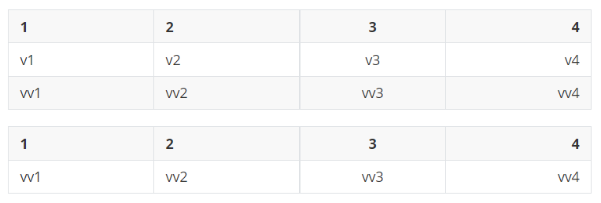
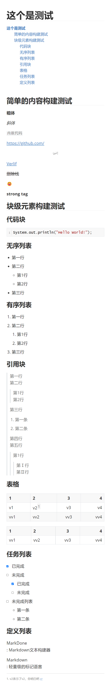

# MarkDone

**MarkDone**是一个`Markdown`文件编辑工具

但它并非是一个编辑器，而是一个构建器。**MarkDone**的目的是为了帮助需要在程序中输出`Markdown`，**MarkDone是一个Markdown构建器**。

也就是说，**MarDone**并不适合用来做手动书写的场景，事实上手动书写`Markdown`文件会更快，我是指单个文件。所以**MarkDone**是为了程序化设计的工具。

## 特点

- 链式构建，所见即所得
- 独立组件，每个组件可以单独使用
- 自由模式，支持任意形式的样式内嵌

## 举例

### 行内元素

```java
InlineItem inlineItem = new InlineItem()
        .bold("粗体").newLine()
        .italic("斜体").newLine()
        .code("内嵌代码").newLine()
        .url("https://github.com/").newLine()
        .img("图片", "https://avatars.githubusercontent.com/u/39126497?s=40&v=4", "我的头像").newLine()
        .src("Verlif", "https://github.com/", "github").newLine()
        .delete("删除线").newLine()
        .emoji("smile").newLine()
        .warpedTag("strong", "strong tag");
System.out.println(inlineItem.build());
```

所得`markdown`显示如下：


### 块级元素

```java
TableItem builder = new TableItem();
builder.start()
        .titles("1", "2")
        .title("3", TableItem.FLOW.CENTER)
        .title("4", TableItem.FLOW.RIGHT)
        .values("v1", "v2", "v3", "v4")
        .values("vv1", "vv2", "vv3", "vv4")
        .repeatTitle()
        .values("vv1", "vv2", "vv3", "vv4")
        .build();
System.out.println(builder);
```

所得`markdown`显示如下：



### 组合模式

```java
MarkDone markDone = new MarkDone();
MarkDone.Editor editor = markDone.getEditor();
markDone.append(new InlineItem().heading(1, "这个是测试"))
        .append(new CatalogItem().start().build())
        .append(new InlineItem().heading(2, "简单的内容构建测试"))
        .append(new InlineItem()
                .bold("粗体").newLine()
                .italic("斜体").newLine()
                .code("内嵌代码").newLine()
                .url("https://github.com/").newLine()
                .img("图片", "https://avatars.githubusercontent.com/u/39126497?s=40&v=4", "我的头像").newLine()
                .src("Verlif", "https://github.com/", "github").newLine()
                .delete("删除线").newLine()
                .emoji("smile").newLine()
                .warpedTag("strong", "strong tag").newLine())
        .append(new InlineItem().heading(2, "块级元素构建测试"))
        .append(new InlineItem().heading(3, "代码块"))
        .append(new CodeItem("java").start()
                .content("System.out.println(\"Hello World!\");").build())
        .append(new InlineItem().heading(3, "无序列表"))
        .append(new DisorderedItem().start()
                .content("第一行")
                .content("第二行")
                .content(new DisorderedItem(2).start()
                        .content("第1行")
                        .content("第2行").build())
                .content("第三行").build())
        .append(new InlineItem().heading(3, "有序列表"))
        .append(new OrderedListItem().start()
                .content("第一行")
                .content("第二行")
                .content(new OrderedListItem(2).start()
                        .content("第1行")
                        .content("第2行").build())
                .content("第三行").build())
        .append(new InlineItem().heading(3, "引用块"))
        .append(new QuoteItem().start()
                .content("第一行")
                .content("第二行")
                .content(new QuoteItem().start()
                        .content("第1行")
                        .content("第2行").build())
                .content("第三行")
                .content(new OrderedListItem(2).start()
                        .content("第一条")
                        .content("第二条").build())
                .content("第四行")
                .content("第五行")
                .content(new QuoteItem().start()
                        .content("第1行")
                        .content(new QuoteItem().start()
                                .content("第Ⅰ行")
                                .content("第Ⅱ行").build()).build()).build())
        .append(new InlineItem().heading(3, "表格"))
        .append(new TableItem().start()
                .titles("1", "2")
                .title("3", TableItem.FLOW.CENTER)
                .title("4", TableItem.FLOW.RIGHT)
                .values("v1", editor.footnote("v2", "1", "v2表示了v2，你明白吧"), "v3", "v4")
                .values("vv1", "vv2", "vv3", "vv4")
                .repeatTitle()
                .values("vv1", "vv2", "vv3", "vv4").build())
        .append(new InlineItem().heading(3, "任务列表"))
        .append(new TodoItem().start()
                .done("已完成")
                .undo("未完成")
                .content(new TodoItem(2).start()
                        .done("已完成")
                        .undo("未完成").build())
                .undo("未完成列表")
                .content(new DisorderedItem(2).start()
                        .content("第一条")
                        .content("第二条").build()).build())
        .append(new InlineItem().heading(3, "定义列表"))
        .append(new DefinitionItem().start()
                .words("MarkDone", "Markdown文本构建器")
                .words("Markdown", "轻量级的标记语言").build());
System.out.println(markDone.build());
```

所得`markdown`显示如下：



## 支持的元素

|  元素  |                      对应组件                      |
|:----:|:----------------------------------------------:|
|  标题  |       `InlineItem.heading(int, String)`        |
|  粗体  |           `InlineItem.bold(String)`            |
|  斜体  |          `InlineItem.italic(String)`           |
| 删除线  |          `InlineItem.delete(String)`           |
| 行内代码 |           `InlineItem.code(String)`            |
|  链接  |            `InlineItem.url(String)`            |
| 资源链接 |  `InlineItem.src(String, String [, String])`   |
|  图片  |  `InlineItem.img(String, String [, String])`   |
|  目录  |                `CatalogItem()`                 |
| 定义列表 |               `DefinitionItem()`               |
| 代码块  |                  `CodeItem()`                  |
| 有序列表 |              `OrderedListItem()`               |
| 无序列表 |             `DisorderedListItem()`             |
| 分割线  |             `HorizontalRuleItem()`             |
| 引用块  |                 `QuoteItem()`                  |
|  表格  |                 `TableItem()`                  |
| 任务列表 |                  `TodoItem()`                  |
|  脚注  |    `MarkDone.getEdit().tag(String, String)`    |
| 参考链接 | `MarkDone.getEdit().reference(String, String)` |
